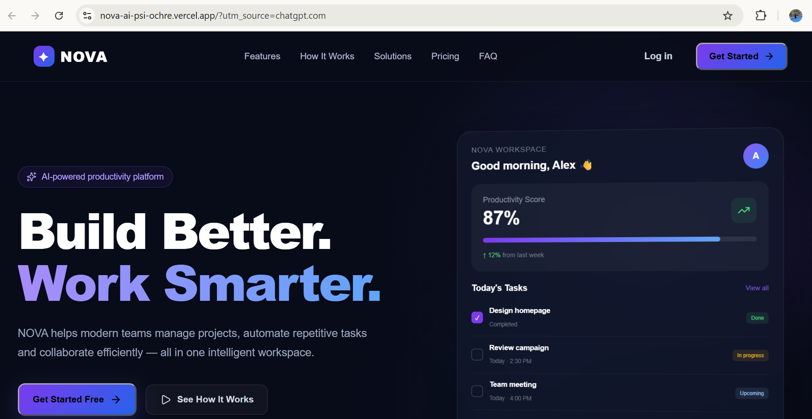
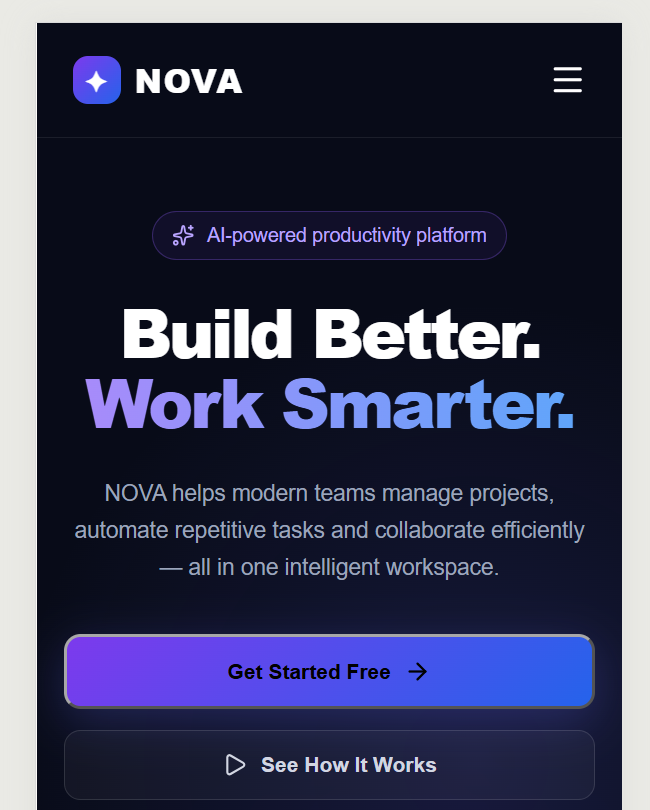

# NOVA — AI Productivity Platform

NOVA is a modern AI-powered productivity platform designed to help teams manage projects, automate repetitive tasks, collaborate efficiently, and improve productivity from one intelligent workspace.

## 🚀 Live Demo

https://nova-ai-psi-ochre.vercel.app/

## 💻 GitHub Repository

https://github.com/Manisha-prajapati/nova-ai

---

## ✨ Features

- Responsive modern landing page
- AI-powered productivity concept
- Responsive navigation with mobile hamburger menu
- Hero section with interactive CTA
- Trusted-by company section
- 6+ feature cards
- Product/About section
- How It Works section
- Animated statistics
- Solutions for different teams
- Interactive testimonials carousel
- Monthly / yearly pricing toggle
- FAQ accordion
- Login modal
- Signup modal
- Interactive Get Started buttons
- Newsletter subscription interaction
- Smooth scrolling navigation
- Responsive footer
- Mobile, tablet and desktop support

---

## 🛠️ Tech Stack

- React.js
- Vite
- JavaScript
- HTML5
- CSS3
- Lucide React Icons
- Git & GitHub
- Vercel

---
## 📸 Screenshots

### Desktop



### Mobile



---

## 🚀 Installation

### 1. Clone the repository

```bash
git clone https://github.com/Manisha-prajapati/nova-ai.git
```

### 2. Navigate to the project folder

```bash
cd nova-ai
```

### 3. Install dependencies

```bash
npm install
```

### 4. Start the development server

```bash
npm run dev
```

The application will be available at:

```text
http://localhost:5173
```

### 5. Build for production

```bash
npm run build
```

### 6. Preview the production build

```bash
npm run preview
```

---

## 📂 Project Structure

```text
nova-ai/
|
├── src/
│   ├── assets/
│   ├── components/
│   │   ├── Navbar.jsx
│   │   ├── Hero.jsx
│   │   ├── TrustedBy.jsx
│   │   ├── Features.jsx
│   │   ├── About.jsx
│   │   ├── HowItWorks.jsx
│   │   ├── Stats.jsx
│   │   ├── Solutions.jsx
│   │   ├── Testimonials.jsx
│   │   ├── Pricing.jsx
│   │   ├── FAQ.jsx
│   │   ├── CTA.jsx
│   │   ├── Footer.jsx
│   │   ├── LoginModal.jsx
│   │   └── SignupModal.jsx
│   ├── App.jsx
│   ├── App.css
│   ├── index.css
│   └── main.jsx
├── public/
├── package.json
└── README.md